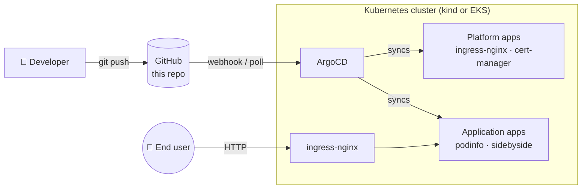

# eks-gitops-platform

Opinionated Kubernetes platform: a **local `kind` cluster** or a
**production-style AWS EKS cluster** managed with Terraform, and a **GitOps
delivery flow** (ArgoCD, app-of-apps) that keeps the cluster in sync with this
repository.

> 🚧 **Status:** in progress. The `kind` cluster and the ArgoCD app-of-apps
> bootstrap are live and verified (see [screenshots](#-what-it-looks-like));
> platform addons, demo apps and observability are landing in incremental PRs.
> See the [roadmap](#-roadmap) below.

---

## 🎯 What this repo demonstrates

- **Infrastructure as Code** — the entire cluster (EKS variant) is a
  `terraform apply` away, using well-known community modules.
- **GitOps delivery** — `kubectl apply` is never used by humans; ArgoCD
  reconciles the live state to what lives in `platform/` and `apps/`.
- **Platform / application split** — cluster addons (ingress, cert-manager)
  are managed the same way as application workloads, but in a separate
  ArgoCD project with stricter sync policies.
- **Local-first dev loop** — you can bring up the whole thing on your laptop
  in a few minutes with `make cluster-up`, no cloud account required.

## 🏗️ Architecture



Two entry points, one delivery model:

| Path | Provisioned by | Cost | Use when |
|---|---|---|---|
| **`kind/`** | `make cluster-up` (Docker) | Free | Local dev, demos, learning |
| **`terraform/`** | `terraform apply` | ~$75–100/mo | Real EKS in AWS |

Both end up running the same `platform/` and `apps/` — the delivery layer is
cluster-agnostic.

## 🚀 Quick start (local)

Requirements: Docker, [kind](https://kind.sigs.k8s.io/), `kubectl`, `helm`, `make`.

> **On Windows:** run `make` from **Git Bash**, not PowerShell or `cmd`. The
> targets use POSIX shell syntax, and GNU Make picks its shell by looking for
> `sh.exe` on `PATH` — which it only finds under Git Bash. From PowerShell it
> falls back to `cmd.exe` and the recipes fail. Note that `bash` on `PATH` is
> often the WSL stub (`C:\Windows\system32\bash.exe`), which is *not* Git Bash.

```bash
make cluster-up          # spins up a 3-node kind cluster with ingress ports
make cluster-status      # sanity check: nodes + system pods
make bootstrap           # installs ArgoCD + applies the root app-of-apps
make argocd-password     # initial admin password
make argocd-ui           # port-forward to http://localhost:8080
```

Once `make bootstrap` finishes, ArgoCD is running and self-managing —
future changes to `platform/argocd/values.yaml` (or any other component)
land via PR, not `helm upgrade`. See
[`platform/argocd/README.md`](./platform/argocd/README.md) for details.

The same bootstrap also delivers a workload, so there is something to look at
besides ArgoCD itself:

**<https://podinfo.127.0.0.1.nip.io>**

No `/etc/hosts` entry and no admin rights: `nip.io` resolves that name straight
back to `127.0.0.1`, and `kind` publishes the cluster's `:443` onto the host.
Your browser will warn about the certificate — it is real and correctly issued,
just signed by the cluster's own CA (`gitops-platform-ca`, from PR 3) rather
than one your browser trusts. Click through. Refresh a few times and the pod
name changes: two replicas, deliberately scheduled onto different nodes.

Tear it down:

```bash
make cluster-down
```

## 📸 What it looks like

After `make bootstrap`, five Applications are reconciling — all `Synced` and
`Healthy`, all owned by the `platform` AppProject:


`root` is the **app-of-apps**: a single Application whose job is to create
other Applications from `platform/argocd/applications/`. It manages four
children — `argocd`, `cert-manager`, `cert-manager-issuers` and
`ingress-nginx` — and it is `Synced` to the merge commit itself:


The first child is the interesting one: **ArgoCD manages itself**. It was
installed once with Helm to break the chicken-and-egg problem, then adopted
into Git. From there, bumping the chart version in
`applications/argocd-self.yaml` and merging the PR is what upgrades ArgoCD —
no `helm upgrade` by hand.

That is not a claim, it is what the tree below shows. Every Deployment has
**two** ReplicaSets: `rev:1` is ArgoCD **v2.12.6**, scaled to zero, and
`rev:2` is **v3.4.5**, holding the running Pods. ArgoCD replaced its own
workloads after [ADR-005](./docs/architecture.md#adr-005--upgrade-argocd-to-3x-and-pin-what-the-majors-made-implicit)
was merged, with nobody touching the cluster:


## ☁️ Production path (AWS EKS)

See [`terraform/README.md`](./terraform/README.md) for the full setup. TL;DR:

```bash
cd terraform
terraform init
terraform plan
terraform apply
aws eks update-kubeconfig --name gitops-platform --region us-east-1
```

## 📁 Repository layout

```
.
├── kind/               kind cluster config + bootstrap scripts
├── terraform/          EKS + VPC (community modules), IAM, addons
├── platform/           Platform components delivered via GitOps
│   ├── argocd/         ArgoCD self-management + AppProjects + root app
│   ├── ingress-nginx/
│   ├── cert-manager/
│   └── namespaces/     Tenant namespaces — platform-owned, see ADR-006
├── apps/               Application workloads delivered via GitOps
│   ├── podinfo/
│   └── sidebyside/     (next)
├── docs/
│   ├── architecture.md ADRs and diagrams
│   └── img/            screenshots used in this README
├── Makefile            developer entrypoints
└── .github/workflows/  fmt/validate/lint (Terraform + YAML)
```

## 🗺️ Roadmap

Shipped work carries its PR number; upcoming work does not, because the last
set of guessed numbers drifted two places and the roadmap quietly lied about
which PR did what.

- [x] **PR 1** — Repo scaffolding, kind cluster, Terraform EKS (validate-only), docs
- [x] **PR 2** — ArgoCD bootstrap + app-of-apps pattern
- [x] **PR 3** — Platform components via GitOps (ingress-nginx, cert-manager)
- [x] **PR 4** — ArgoCD 2.12 → 3.4, applied by ArgoCD to itself ([ADR-005](./docs/architecture.md))
- [x] **PR 5** — ADR-005 correction + screenshots refreshed against the upgraded cluster
- [x] **PR 6** — First workload app: podinfo, with platform-owned namespaces ([ADR-006](./docs/architecture.md))
- [ ] Side by Side (Next.js) — the app this platform exists to carry; needs a Dockerfile first
- [ ] Observability stack (Prometheus + Grafana + Loki)
- [ ] Cost analysis + disaster recovery runbook

## 📄 License

[MIT](./LICENSE)
