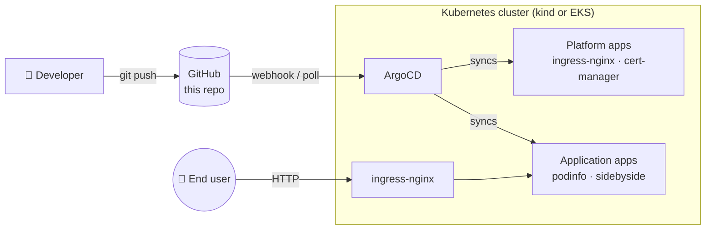

# eks-gitops-platform

Opinionated Kubernetes platform: a **local `kind` cluster** or a
**production-style AWS EKS cluster** managed with Terraform, and a **GitOps
delivery flow** (ArgoCD, app-of-apps) that keeps the cluster in sync with this
repository.

> 🚧 **Status:** bootstrapping. This README describes the target architecture;
> incremental PRs are landing the pieces. See the [roadmap](#-roadmap) below.

---

## 🎯 What this repo demonstrates

- **Infrastructure as Code** — the entire cluster (EKS variant) is a
  `terraform apply` away, using well-known community modules.
- **GitOps delivery** — `kubectl apply` is never used by humans; ArgoCD
  reconciles the live state to what lives in `platform/` and `apps/`.
- **Platform / application split** — cluster addons (ingress, cert-manager)
  are managed the same way as application workloads, but in a separate
  ArgoCD project with stricter sync policies.
- **Local-first dev loop** — you can bring up the whole thing on your laptop
  in a few minutes with `make cluster-up`, no cloud account required.

## 🏗️ Architecture



Two entry points, one delivery model:

| Path | Provisioned by | Cost | Use when |
|---|---|---|---|
| **`kind/`** | `make cluster-up` (Docker) | Free | Local dev, demos, learning |
| **`terraform/`** | `terraform apply` | ~$75–100/mo | Real EKS in AWS |

Both end up running the same `platform/` and `apps/` — the delivery layer is
cluster-agnostic.

## 🚀 Quick start (local)

Requirements: Docker, [kind](https://kind.sigs.k8s.io/), `kubectl`, `make`.

```bash
make cluster-up      # spins up a 3-node kind cluster with ingress ports
make cluster-status  # sanity check: nodes + system pods
# (next PR) make bootstrap    # installs ArgoCD and points it at this repo
```

Tear it down:

```bash
make cluster-down
```

## ☁️ Production path (AWS EKS)

See [`terraform/README.md`](./terraform/README.md) for the full setup. TL;DR:

```bash
cd terraform
terraform init
terraform plan
terraform apply
aws eks update-kubeconfig --name gitops-platform --region us-east-1
```

## 📁 Repository layout

```
.
├── kind/               kind cluster config + bootstrap scripts
├── terraform/          EKS + VPC (community modules), IAM, addons
├── platform/           Platform components delivered via GitOps
│   ├── argocd/         (next PR) ArgoCD self-management + AppProjects
│   ├── ingress-nginx/
│   └── cert-manager/
├── apps/               Application workloads delivered via GitOps
│   ├── podinfo/
│   └── sidebyside/     (later PR)
├── docs/
│   └── architecture.md ADRs and diagrams
├── Makefile            developer entrypoints
└── .github/workflows/  fmt/validate/lint (Terraform + YAML)
```

## 🗺️ Roadmap

- [x] **PR 1** — Repo scaffolding, kind cluster, Terraform EKS (validate-only), docs
- [ ] **PR 2** — ArgoCD bootstrap + app-of-apps pattern
- [ ] **PR 3** — Platform components via GitOps (ingress-nginx, cert-manager)
- [ ] **PR 4** — Demo apps (podinfo + sidebyside)
- [ ] **PR 5** — Observability stack (Prometheus + Grafana + Loki)
- [ ] **PR 6** — Cost analysis + disaster recovery runbook

## 📄 License

[MIT](./LICENSE)
