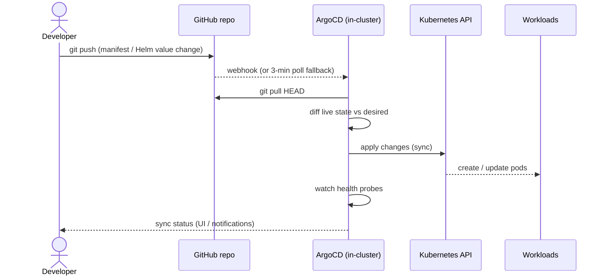
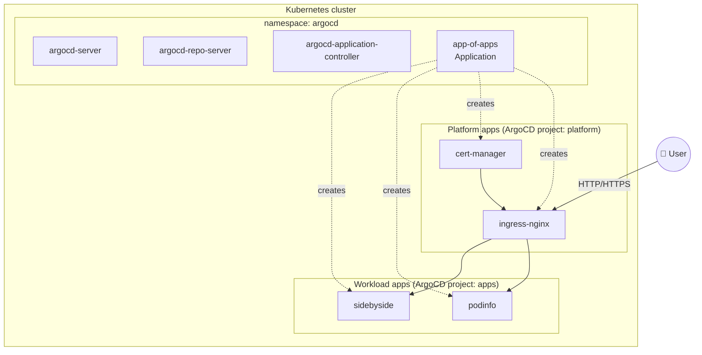

# Architecture

## GitOps delivery flow

The cluster's live state is a function of what lives in this repo. There is
no imperative `kubectl apply` step performed by humans.

## Component map

The **app-of-apps** pattern gives us a single root ArgoCD `Application` that
declares child `Application`s for every workload. Adding a new app means one
file in `platform/argocd/apps/` — ArgoCD picks it up automatically.

## Cluster options

Two clusters, same delivery layer:

| Concern | `kind` (local) | `terraform/` (EKS) |
|---|---|---|
| Bring-up time | ~30 seconds | ~15 minutes |
| Cost | Free | ~$75–100/mo |
| LoadBalancer type | `NodePort` + host ports | ELB/ALB via controller |
| Storage | `local-path-provisioner` | `gp3` via EBS CSI |
| DNS | `/etc/hosts` or nip.io | Route53 + external-dns |
| Node auth | Static | IAM + IRSA/Pod Identity |

Manifests in `platform/` and `apps/` are written to work on both.

## Architecture Decision Records

### ADR-001 — Community Terraform modules for VPC and EKS

**Context:** Provisioning EKS from scratch requires wiring IAM, OIDC,
addons, node groups, and ALB controller permissions.

**Decision:** Consume `terraform-aws-modules/vpc` and
`terraform-aws-modules/eks` instead of rolling our own.

**Rationale:** These modules are used at scale in production, are audited by
many, and evolve with EKS. Reinventing them would be a distraction from the
GitOps story this repo is trying to tell.

**Consequences:** Locked to the modules' upgrade cadence for breaking changes,
but that's a good tradeoff given the maintenance we save.

### ADR-002 — `kind` as primary local dev target

**Context:** A real EKS cluster costs ~$100/mo and takes 15 minutes to
provision — friction that discourages iteration.

**Decision:** `kind/cluster.yaml` is the primary target for day-to-day
development. Terraform/EKS is a validated code path but not the default.

**Rationale:** The GitOps flow (ArgoCD → apply) is identical in both. Being
able to `make cluster-up` in 30 seconds massively speeds up the feedback loop
when authoring platform components.

**Consequences:** Some cloud-specific integrations (external-dns, ACM certs,
IRSA) can only be tested end-to-end on the EKS variant.

### ADR-003 — App-of-apps over ApplicationSet (for now)

**Context:** ArgoCD offers two patterns for bulk app management:
app-of-apps (Application that creates Applications) and ApplicationSet
(templates that generate Applications from generators).

**Decision:** Start with app-of-apps.

**Rationale:** App-of-apps is simpler, easier to read, and covers our
current scale. ApplicationSet shines when you need dynamic generation (per
tenant, per PR preview) which we don't yet.

**Consequences:** Adding an app is a file addition, not a generator config
change. Revisit if we start managing >20 apps or need PR preview
environments.
