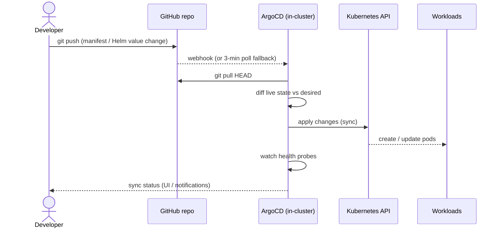
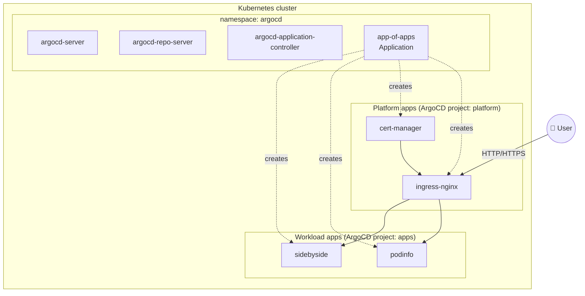

# Architecture

## GitOps delivery flow

The cluster's live state is a function of what lives in this repo. There is
no imperative `kubectl apply` step performed by humans.



## Component map



The **app-of-apps** pattern gives us a single root ArgoCD `Application` that
declares child `Application`s for every workload. Adding a new app means one
file in `platform/argocd/applications/` — ArgoCD picks it up automatically.

## Cluster options

Two clusters, same delivery layer:

| Concern | `kind` (local) | `terraform/` (EKS) |
|---|---|---|
| Bring-up time | ~30 seconds | ~15 minutes |
| Cost | Free | ~$75–100/mo |
| LoadBalancer type | `NodePort` + host ports | ELB/ALB via controller |
| Storage | `local-path-provisioner` | `gp3` via EBS CSI |
| DNS | `/etc/hosts` or nip.io | Route53 + external-dns |
| Node auth | Static | IAM + IRSA/Pod Identity |

Manifests in `platform/` and `apps/` are written to work on both. The one
place that genuinely cannot be shared is the network edge (the `LoadBalancer`
row above): ingress-nginx needs different values per cluster, so it carries a
small per-cluster overlay next to its portable values. See
[ADR-004](#adr-004--per-cluster-values-overlays-not-one-portable-values-file).

## Architecture Decision Records

### ADR-001 — Community Terraform modules for VPC and EKS

**Context:** Provisioning EKS from scratch requires wiring IAM, OIDC,
addons, node groups, and ALB controller permissions.

**Decision:** Consume `terraform-aws-modules/vpc` and
`terraform-aws-modules/eks` instead of rolling our own.

**Rationale:** These modules are used at scale in production, are audited by
many, and evolve with EKS. Reinventing them would be a distraction from the
GitOps story this repo is trying to tell.

**Consequences:** Locked to the modules' upgrade cadence for breaking changes,
but that's a good tradeoff given the maintenance we save.

### ADR-002 — `kind` as primary local dev target

**Context:** A real EKS cluster costs ~$100/mo and takes 15 minutes to
provision — friction that discourages iteration.

**Decision:** `kind/cluster.yaml` is the primary target for day-to-day
development. Terraform/EKS is a validated code path but not the default.

**Rationale:** The GitOps flow (ArgoCD → apply) is identical in both. Being
able to `make cluster-up` in 30 seconds massively speeds up the feedback loop
when authoring platform components.

**Consequences:** Some cloud-specific integrations (external-dns, ACM certs,
IRSA) can only be tested end-to-end on the EKS variant.

### ADR-003 — App-of-apps over ApplicationSet (for now)

**Context:** ArgoCD offers two patterns for bulk app management:
app-of-apps (Application that creates Applications) and ApplicationSet
(templates that generate Applications from generators).

**Decision:** Start with app-of-apps.

**Rationale:** App-of-apps is simpler, easier to read, and covers our
current scale. ApplicationSet shines when you need dynamic generation (per
tenant, per PR preview) which we don't yet.

**Consequences:** Adding an app is a file addition, not a generator config
change. Revisit if we start managing >20 apps or need PR preview
environments.

### ADR-004 — Per-cluster values overlays, not one portable values file

**Context:** The delivery layer is meant to be cluster-agnostic, and for most
components it genuinely is — cert-manager talks to the Kubernetes API and
neither knows nor cares what runs underneath. ingress-nginx is the exception:
it sits at the network edge, and the edge is exactly what differs. On EKS it
asks for an NLB and gets one. On `kind` there is no cloud controller, so a
`type: LoadBalancer` Service stays `<pending>` forever; the controller must
instead bind the node's host ports, which only works if it is pinned to the
node whose ports `kind` published.

Those are not the same config, and no amount of wishing makes them one.

**Decision:** Split Helm values into a portable `values.yaml` plus a
per-cluster overlay (`values-kind.yaml`, later `values-eks.yaml`). The
Application layers them in order, last file wins:

```yaml
valueFiles:
  - $values/platform/ingress-nginx/values.yaml
  - $values/platform/ingress-nginx/values-kind.yaml
```

**Rationale:** The alternative — one values file with the union of both
clusters' settings — either breaks on one of them or hides the difference
behind conditionals. Naming the seam is more honest, and it keeps the
interesting question ("what actually differs between local and cloud?")
answerable by diffing two short files. Retargeting a component to EKS becomes
a one-line change in its Application.

**Consequences:** Two files per edge-facing component instead of one, and the
overlay is chosen by editing the Application rather than by a flag — a
deliberate constraint, since ArgoCD resolves it at sync time from Git and
there is no `--set cluster=kind` to reach for. Components that do not touch
the edge (cert-manager today) keep a single `values.yaml` and no overlay;
adding one "for symmetry" would be cargo cult.

`values-eks.yaml` is **not** in this repo yet: writing it would mean shipping
config no one has ever run, and the EKS path is still `terraform validate`
only. It lands with the first real EKS apply.

### ADR-005 — Upgrade ArgoCD to 3.x, and pin what the majors made implicit

**Context:** The bootstrap pinned chart `7.6.12`, which ships ArgoCD `v2.12.6`
— released late 2024 and tested against Kubernetes ~1.31. `kind` now
provisions 1.36. Kubernetes 1.36 declares `deployment.status.terminatingReplicas`
and populates it even at rest; the OpenAPI schema embedded in 2.12.6 has never
heard of the field, so the structured-merge diff dies with
`ComparisonError: .status.terminatingReplicas: field not declared in schema`.

That error is not cosmetic. An Application whose diff cannot be computed cannot
have its sync operation concluded, and the blast radius depends on what the
component needs. `cert-manager` merely flaps to `Unknown` while its pods run
happily. `ingress-nginx` — the only component here with a PreSync hook — gets
stuck permanently: its `admission-create` Job runs, succeeds, is deleted by the
chart's `hook-succeeded` delete policy, and then the operation hangs forever on
`waiting for completion of hook batch/Job/ingress-nginx-admission-create`
because the diff that would let ArgoCD call the operation done never completes.
The component never deploys. Five Kubernetes minor versions of skew is not a
version number problem; it is a broken cluster.

**Decision:** Bump to chart `10.1.3` (ArgoCD `v3.4.5`), and write down the two
defaults the intervening majors changed underneath us rather than inheriting
them silently.

**Rationale:** The upgrade crosses three chart majors and one ArgoCD major, so
it was worth auditing rather than trusting. Rendering `10.1.3` against our
existing `values.yaml` produces a clean template with every key still live and
every setting still landing — the values needed no migration at all. What did
change is behaviour, in three places, only one of which is interesting:

| Change | Source | Verdict |
|---|---|---|
| Resource tracking `label` → `annotation` | ArgoCD 3.0 | Accepted, now pinned |
| `global.networkPolicy.create` `false` → `true` | Chart 10.0.0 | Accepted |
| `applicationsetcontroller.policy` `sync` → `""` | Chart 9.0.0 | Moot — ADR-003 |
| Fine-grained RBAC stops inheriting to sub-resources | ArgoCD 3.0 | Moot — single local admin |
| Logs RBAC always enforced | ArgoCD 3.0 | Moot — single local admin |

On **tracking**, upstream's own guidance is to take the new default, and the
alternative — pinning `label` to preserve v2 semantics — buys nothing but
deferred work. The documented edge case (a resource deleted in the very first
sync after the switch can be orphaned) is a real risk on a long-lived cluster
and a non-risk here, where the cluster is disposable by construction (ADR-002)
and `make cluster-down` is the escape hatch. But taking a default is not the
same as leaving it unstated: `application.resourceTrackingMethod: annotation`
is now written in `values.yaml`, because the whole reason this ADR exists is
that a default changed under a pin we thought was total.

On **NetworkPolicies**, the chart now ships four, and `kindnet` enforces them
— so unlike on many local setups they are not decorative here. They were read
before being accepted: all four are `Ingress`-only, so nothing constrains
ArgoCD's egress to GitHub or the Helm repos; `argocd-server` accepts from
anywhere, so `make argocd-ui` keeps working; and `repo-server` and `redis`
admit exactly the ArgoCD components that call them. They match the topology
this repo actually runs.

**Consequences:** The chart version lives in two places that must not drift —
`ARGOCD_CHART_V` in the `Makefile` (what a first bootstrap installs) and
`targetRevision` in `applications/argocd-self.yaml` (what ArgoCD applies to
itself). Bumping one alone means a fresh `make bootstrap` installs a different
ArgoCD than the one Git converges to; both move together or neither does.

Existing resources carry the old `argocd.argoproj.io/instance` label until
their next sync rewrites it as a tracking annotation, so a one-time `OutOfSync`
churn across previously-synced apps is expected and is not a failure.

The upgrade is also its own best demonstration: bumping `targetRevision` and
merging is a change ArgoCD picks up and applies **to itself**, with no
`helm upgrade` and no human touching the cluster. The bootstrap Helm release
installs ArgoCD exactly once; every version after that arrives through Git.
