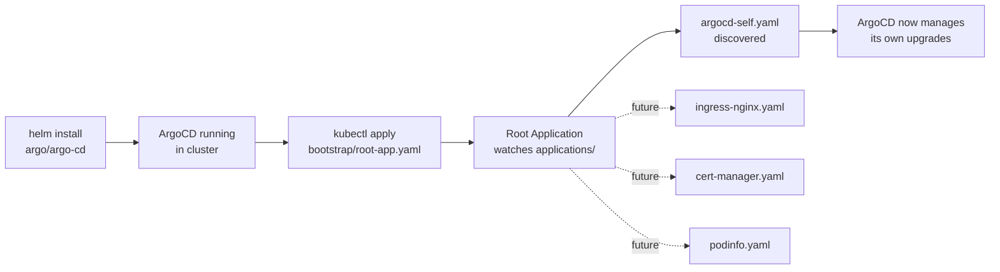

# ArgoCD

The GitOps control plane. Installed once via Helm, then self-managed from
this directory.

## Bootstrap flow



One command bootstraps the whole chain:

```bash
make bootstrap           # helm install + AppProjects + kubectl apply root-app.yaml
```

From that point on, ArgoCD is the only thing that talks to the cluster.

## Layout

```
.
├── values.yaml               Helm values (source of truth after bootstrap)
├── bootstrap/
│   └── root-app.yaml         The app-of-apps root — kubectl apply ONCE
├── projects/                 AppProjects: RBAC-scoped buckets
│   ├── platform.yaml         Cluster-wide platform components
│   └── apps.yaml             Namespaced application workloads
└── applications/             Child Applications, auto-discovered by root
    └── argocd-self.yaml      ArgoCD managing its own Helm release
```

## AppProject split

Two projects on purpose — different blast radius, different permissions:

| Project | Namespaces | Cluster resources | Repos allowed |
|---|---|---|---|
| `platform` | `*` | ✅ any | this repo + platform chart repos |
| `apps` | `podinfo`, `sidebyside` | ❌ none | this repo + app chart repos |

## Access the UI

```bash
make argocd-ui           # port-forward :8080
make argocd-password     # print initial admin password
```

Then open http://localhost:8080 and log in as `admin` with the printed
password. Change or disable it once you're done exploring — the initial
secret is meant to be rotated.

## Design notes

- **Self-management on purpose.** After bootstrap, upgrading ArgoCD is a
  PR that bumps `targetRevision` in `applications/argocd-self.yaml` — same
  workflow as any other component.
- **`prune: false` on the self-app** — pruning ArgoCD's own resources
  during a bad sync could kill the controller mid-reconcile. Self-heal is
  still on, so drift is corrected.
- **`ServerSideApply=true`** everywhere — plays much nicer with CRDs and
  webhook conversions than the legacy client-side merge.
- **Helm must not touch ArgoCD after bootstrap.** This is the one sharp edge
  of self-management, and it follows from server-side apply: once the
  self-app syncs, the `argocd-controller` field manager owns the fields on
  ArgoCD's own Deployments. A later `helm upgrade` applies with a different
  field manager and is rejected:

  ```
  conflict with "argocd-controller":
  .spec.template.spec.containers[name="applicationset-controller"]
  .env[name="NAMESPACE"].valueFrom.fieldRef
  ```

  That rejection is the pattern working, not breaking — Git is the only way
  in. `make argocd-install` therefore detects an existing release and skips,
  which keeps `make bootstrap` safely re-runnable.
- **Root uses `directory.recurse: true`** so adding a new Application is
  a file addition, not a config change.
